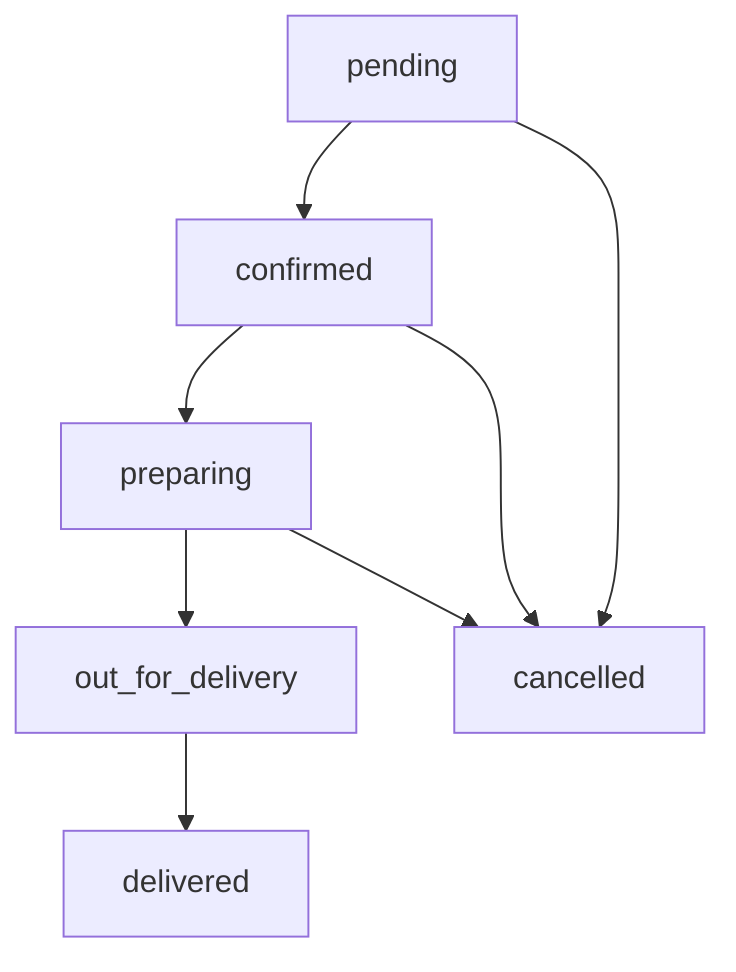

# 📚 API Documentation - Refactorización de Categorías

## 🎯 Resumen de Cambios

La API ha sido **completamente refactorizada** para separar las categorías genéricas en dos entidades específicas:

- **RestaurantCategory**: Categorías para clasificar restaurantes (ej: Comida Rápida, Italiana, Asiática)
- **MenuCategory**: Categorías para organizar elementos del menú dentro de cada restaurante (ej: Entradas, Platos Principales, Postres)

---

## 🏪 Restaurant Categories API

### Base URL: `/restaurant-categories`

Gestiona las categorías de restaurantes a nivel global del sistema.

#### 📋 Listar todas las categorías de restaurantes

```http
GET /restaurant-categories
```

**Autenticación:** Requerida  
**Roles:** Todos los usuarios autenticados  
**Respuesta:**

```json
[
  {
    "id": "uuid",
    "name": "Comida Rápida",
    "description": "Restaurantes de comida rápida",
    "icon": "fast-food-icon.png",
    "isActive": true,
    "createdAt": "2025-08-25T10:00:00Z",
    "updatedAt": "2025-08-25T10:00:00Z"
  }
]
```

#### 🔍 Obtener una categoría específica

```http
GET /restaurant-categories/{id}
```

**Autenticación:** Requerida  
**Parámetros:**

- `id` (UUID): ID de la categoría

**Respuesta:**

```json
{
  "id": "uuid",
  "name": "Comida Italiana",
  "description": "Restaurantes especializados en comida italiana",
  "icon": "italian-food-icon.png",
  "isActive": true,
  "createdAt": "2025-08-25T10:00:00Z",
  "updatedAt": "2025-08-25T10:00:00Z",
  "restaurants": [
    {
      "id": "uuid",
      "name": "Pizza Roma",
      "address": "Av. Arequipa 123"
    }
  ]
}
```

#### ➕ Crear nueva categoría de restaurante

```http
POST /restaurant-categories
```

**Autenticación:** Requerida  
**Roles:** `SUPER_ADMIN`  
**Body:**

```json
{
  "name": "Comida Vegana",
  "description": "Restaurantes especializados en comida vegana",
  "icon": "vegan-icon.png",
  "isActive": true
}
```

**Respuesta:** `201 Created`

```json
{
  "id": "new-uuid",
  "name": "Comida Vegana",
  "description": "Restaurantes especializados en comida vegana",
  "icon": "vegan-icon.png",
  "isActive": true,
  "createdAt": "2025-08-25T10:00:00Z",
  "updatedAt": "2025-08-25T10:00:00Z"
}
```

#### ✏️ Actualizar categoría de restaurante

```http
PATCH /restaurant-categories/{id}
```

**Autenticación:** Requerida  
**Roles:** `SUPER_ADMIN`  
**Body:** (campos opcionales)

```json
{
  "name": "Comida Vegana Premium",
  "description": "Restaurantes especializados en comida vegana gourmet",
  "isActive": false
}
```

#### 🗑️ Eliminar categoría de restaurante

```http
DELETE /restaurant-categories/{id}
```

**Autenticación:** Requerida  
**Roles:** `SUPER_ADMIN`  
**Respuesta:** `204 No Content`

#### 🚫 Desactivar categoría (soft delete)

```http
PATCH /restaurant-categories/{id}/deactivate
```

**Autenticación:** Requerida  
**Roles:** `SUPER_ADMIN`  
**Respuesta:**

```json
{
  "id": "uuid",
  "name": "Comida Vegana",
  "isActive": false,
  "updatedAt": "2025-08-25T10:00:00Z"
}
```

---

## 🍽️ Menu Categories API

### Base URL: `/restaurants/{restaurantId}/menu-categories`

Gestiona las categorías de menú específicas de cada restaurante.

#### 📋 Listar categorías de menú de un restaurante

```http
GET /restaurants/{restaurantId}/menu-categories
```

**Autenticación:** Requerida  
**Parámetros:**

- `restaurantId` (UUID): ID del restaurante

**Respuesta:**

```json
[
  {
    "id": "uuid",
    "name": "Entradas",
    "description": "Platos de entrada",
    "sortOrder": 1,
    "isActive": true,
    "createdAt": "2025-08-25T10:00:00Z",
    "updatedAt": "2025-08-25T10:00:00Z",
    "menuItems": [
      {
        "id": "uuid",
        "name": "Bruschetta",
        "price": 15.5
      }
    ]
  },
  {
    "id": "uuid",
    "name": "Platos Principales",
    "description": "Platos principales del menú",
    "sortOrder": 2,
    "isActive": true,
    "menuItems": []
  }
]
```

#### 🔍 Obtener una categoría de menú específica

```http
GET /restaurants/{restaurantId}/menu-categories/{id}
```

**Autenticación:** Requerida  
**Parámetros:**

- `restaurantId` (UUID): ID del restaurante
- `id` (UUID): ID de la categoría de menú

#### ➕ Crear nueva categoría de menú

```http
POST /restaurants/{restaurantId}/menu-categories
```

**Autenticación:** Requerida  
**Roles:** `RESTAURANT_OWNER`, `SUPER_ADMIN`  
**Body:**

```json
{
  "name": "Bebidas",
  "description": "Bebidas frías y calientes",
  "sortOrder": 5,
  "isActive": true
}
```

#### ✏️ Actualizar categoría de menú

```http
PATCH /restaurants/{restaurantId}/menu-categories/{id}
```

**Autenticación:** Requerida  
**Roles:** `RESTAURANT_OWNER`, `SUPER_ADMIN`  
**Body:** (campos opcionales)

```json
{
  "name": "Bebidas Especiales",
  "sortOrder": 3
}
```

#### 🗑️ Eliminar categoría de menú

```http
DELETE /restaurants/{restaurantId}/menu-categories/{id}
```

**Autenticación:** Requerida  
**Roles:** `RESTAURANT_OWNER`, `SUPER_ADMIN`

#### 🚫 Desactivar categoría de menú

```http
PATCH /restaurants/{restaurantId}/menu-categories/{id}/deactivate
```

**Autenticación:** Requerida  
**Roles:** `RESTAURANT_OWNER`, `SUPER_ADMIN`

---

## 🔄 Cambios en Endpoints Existentes

### 🏪 Restaurants API

#### ➕ Crear restaurante (ACTUALIZADO)

```http
POST /restaurants
```

**Cambios en el body:**

- ❌ `categoryId` (eliminado)
- ✅ `restaurantCategoryId` (nuevo)

**Body:**

```json
{
  "name": "Pizza Roma",
  "address": "Av. Arequipa 123",
  "phone": "+51987654321",
  "longitude": -77.042793,
  "latitude": -12.046374,
  "restaurantCategoryId": "uuid-categoria-italiana",
  "ownerId": "uuid-propietario"
}
```

#### ✏️ Actualizar restaurante (ACTUALIZADO)

```http
PATCH /restaurants/{id}
```

**Cambios en el body:**

- ❌ `categoryId` (eliminado)
- ✅ `restaurantCategoryId` (nuevo)

#### 📋 Listar restaurantes (SIN CAMBIOS)

```http
GET /restaurants
```

```http
GET /restaurants?latitude=-12.046374&longitude=-77.042793&radius=5
```

### 🍽️ Menu Items API

#### ➕ Crear item de menú (ACTUALIZADO)

```http
POST /restaurants/{restaurantId}/menu-items
```

**Cambios en el body:**

- ❌ `categoryId` (eliminado)
- ✅ `menuCategoryId` (nuevo)

**Body:**

```json
{
  "name": "Pizza Margherita",
  "description": "Pizza tradicional italiana",
  "price": 25.9,
  "imageUrl": "https://example.com/pizza.jpg",
  "restaurantId": "uuid-restaurante",
  "menuCategoryId": "uuid-categoria-principales"
}
```

#### ✏️ Actualizar item de menú (ACTUALIZADO)

```http
PATCH /restaurants/{restaurantId}/menu-items/{itemId}
```

**Cambios en el body:**

- ❌ `categoryId` (eliminado)
- ✅ `menuCategoryId` (nuevo)

#### 📋 Listar items de menú (SIN CAMBIOS)

```http
GET /restaurants/{restaurantId}/menu-items
```

#### 🔍 Obtener item de menú (SIN CAMBIOS)

```http
GET /restaurants/{restaurantId}/menu-items/{itemId}
```

#### 🗑️ Eliminar item de menú (SIN CAMBIOS)

```http
DELETE /restaurants/{restaurantId}/menu-items/{itemId}
```

---

## 🚫 Endpoints Eliminados

Los siguientes endpoints han sido **eliminados** del `RestaurantsController`:

### ❌ Endpoints de categorías eliminados:

- `GET /restaurants/categories/all`
- `POST /restaurants/categories`
- `POST /restaurants/categories/seed`

### 🔄 Migración de endpoints:

| Endpoint Antiguo                    | Nuevo Endpoint                            |
| ----------------------------------- | ----------------------------------------- |
| `GET /restaurants/categories/all`   | `GET /restaurant-categories`              |
| `POST /restaurants/categories`      | `POST /restaurant-categories`             |
| `POST /restaurants/categories/seed` | `POST /restaurant-categories` (múltiples) |

---

## 🔐 Roles y Permisos

### Restaurant Categories:

- **Lectura** (`GET`): Todos los usuarios autenticados
- **Escritura** (`POST`, `PATCH`, `DELETE`): Solo `SUPER_ADMIN`

### Menu Categories:

- **Lectura** (`GET`): Todos los usuarios autenticados
- **Escritura** (`POST`, `PATCH`, `DELETE`): `RESTAURANT_OWNER` y `SUPER_ADMIN`

### Matriz de Permisos:

| Acción                          | CLIENT | DRIVER | RESTAURANT_OWNER | SUPER_ADMIN |
| ------------------------------- | ------ | ------ | ---------------- | ----------- |
| Ver categorías de restaurante   | ✅     | ✅     | ✅               | ✅          |
| Crear categorías de restaurante | ❌     | ❌     | ❌               | ✅          |
| Ver categorías de menú          | ✅     | ✅     | ✅               | ✅          |
| Gestionar categorías de menú    | ❌     | ❌     | ✅               | ✅          |

---

## 📊 Estructura de Base de Datos

### RestaurantCategory

```sql
CREATE TABLE restaurant_categories (
  id UUID PRIMARY KEY DEFAULT gen_random_uuid(),
  name VARCHAR(100) UNIQUE NOT NULL,
  description TEXT,
  icon VARCHAR(255),
  is_active BOOLEAN DEFAULT TRUE,
  created_at TIMESTAMPTZ DEFAULT NOW(),
  updated_at TIMESTAMPTZ DEFAULT NOW()
);

-- Índices recomendados
CREATE INDEX idx_restaurant_categories_active ON restaurant_categories(is_active);
CREATE INDEX idx_restaurant_categories_name ON restaurant_categories(name);
```

### MenuCategory

```sql
CREATE TABLE menu_categories (
  id UUID PRIMARY KEY DEFAULT gen_random_uuid(),
  name VARCHAR(100) NOT NULL,
  description TEXT,
  sort_order INTEGER DEFAULT 0,
  is_active BOOLEAN DEFAULT TRUE,
  restaurant_id UUID NOT NULL REFERENCES restaurants(id) ON DELETE CASCADE,
  created_at TIMESTAMPTZ DEFAULT NOW(),
  updated_at TIMESTAMPTZ DEFAULT NOW()
);

-- Índices recomendados
CREATE INDEX idx_menu_categories_restaurant ON menu_categories(restaurant_id);
CREATE INDEX idx_menu_categories_active ON menu_categories(is_active);
CREATE INDEX idx_menu_categories_sort ON menu_categories(restaurant_id, sort_order, name);
```

### Relaciones Actualizadas:

```sql
-- Actualizar tabla restaurants
ALTER TABLE restaurants
DROP COLUMN IF EXISTS category_id,
ADD COLUMN restaurant_category_id UUID REFERENCES restaurant_categories(id);

-- Actualizar tabla menu_items
ALTER TABLE menu_items
DROP COLUMN IF EXISTS category_id,
ADD COLUMN menu_category_id UUID REFERENCES menu_categories(id);
```

---

## 🧪 Ejemplos de Uso Completos

### 1. Flujo completo: Crear estructura para un restaurante

```bash
# Paso 1: Crear categoría de restaurante (solo SUPER_ADMIN)
POST /restaurant-categories
Authorization: Bearer {jwt-token}
{
  "name": "Comida Italiana",
  "description": "Restaurantes especializados en comida italiana",
  "icon": "italian-icon.png"
}

# Respuesta: { "id": "cat-rest-uuid", ... }

# Paso 2: Crear restaurante
POST /restaurants
Authorization: Bearer {jwt-token}
{
  "name": "Nonna's Kitchen",
  "address": "Av. Larco 456",
  "phone": "+51987654321",
  "longitude": -77.042793,
  "latitude": -12.046374,
  "restaurantCategoryId": "cat-rest-uuid",
  "ownerId": "owner-uuid"
}

# Respuesta: { "id": "restaurant-uuid", ... }

# Paso 3: Crear categorías de menú
POST /restaurants/restaurant-uuid/menu-categories
Authorization: Bearer {jwt-token}
{
  "name": "Entradas",
  "description": "Platos de entrada",
  "sortOrder": 1
}

POST /restaurants/restaurant-uuid/menu-categories
Authorization: Bearer {jwt-token}
{
  "name": "Platos Principales",
  "description": "Platos principales del menú",
  "sortOrder": 2
}

POST /restaurants/restaurant-uuid/menu-categories
Authorization: Bearer {jwt-token}
{
  "name": "Postres",
  "description": "Postres y dulces",
  "sortOrder": 3
}

# Paso 4: Crear items de menú
POST /restaurants/restaurant-uuid/menu
Authorization: Bearer {jwt-token}
{
  "name": "Bruschetta al Pomodoro",
  "description": "Pan tostado con tomate fresco",
  "price": 18.50,
  "menuCategoryId": "entradas-uuid"
}

POST /restaurants/restaurant-uuid/menu
Authorization: Bearer {jwt-token}
{
  "name": "Spaghetti Carbonara",
  "description": "Pasta con huevo, queso y panceta",
  "price": 32.00,
  "menuCategoryId": "principales-uuid"
}
```

### 2. Consultar información completa

```bash
# Listar todas las categorías de restaurante
GET /restaurant-categories
Authorization: Bearer {jwt-token}

# Buscar restaurantes cercanos (geolocalización)
GET /restaurants?latitude=-12.046374&longitude=-77.042793&radius=5
Authorization: Bearer {jwt-token}

# Ver restaurante específico
GET /restaurants/restaurant-uuid
Authorization: Bearer {jwt-token}

# Ver menú completo de un restaurante
GET /restaurants/restaurant-uuid/menu-categories
Authorization: Bearer {jwt-token}

# Ver items de una categoría específica
GET /restaurants/restaurant-uuid/menu-categories/entradas-uuid
Authorization: Bearer {jwt-token}
```

### 3. Administración de categorías

```bash
# SUPER_ADMIN: Gestionar categorías de restaurante
GET /restaurant-categories
POST /restaurant-categories
PATCH /restaurant-categories/{id}
DELETE /restaurant-categories/{id}

# RESTAURANT_OWNER: Gestionar categorías de menú
GET /restaurants/{restaurantId}/menu-categories
POST /restaurants/{restaurantId}/menu-categories
PATCH /restaurants/{restaurantId}/menu-categories/{id}
DELETE /restaurants/{restaurantId}/menu-categories/{id}

# Reorganizar orden de categorías de menú
PATCH /restaurants/{restaurantId}/menu-categories/entradas-uuid
{
  "sortOrder": 5
}
```

---

## 🚀 Beneficios de la Refactorización

### ✅ Ventajas:

1. **Separación de responsabilidades**: Categorías globales vs. categorías específicas
2. **Flexibilidad**: Cada restaurante puede tener sus propias categorías de menú
3. **Escalabilidad**: Mejor organización para múltiples restaurantes
4. **Administración**: Control granular de permisos por tipo de categoría
5. **Ordenamiento**: Las categorías de menú tienen orden configurable
6. **Mantenibilidad**: Código más limpio y organizadamente estructurado
7. **Extensibilidad**: Fácil agregar nuevas funcionalidades específicas

### 🎯 Casos de uso resueltos:

- Restaurante italiano con categorías: "Antipasti", "Primi Piatti", "Secondi Piatti"
- Restaurante de comida rápida con: "Combos", "Hamburguesas", "Acompañamientos"
- Cafetería con: "Bebidas Calientes", "Bebidas Frías", "Snacks", "Postres"

---

## ⚠️ Consideraciones de Migración

### Para desarrolladores:

1. **Actualizar frontend**: Cambiar `categoryId` por `restaurantCategoryId` y `menuCategoryId`
2. **Revisar validaciones**: Los nuevos DTOs tienen validaciones actualizadas
3. **Actualizar tests**: Los endpoints de categorías han cambiado
4. **Base de datos**: Ejecutar migraciones para restructurar tablas

### Para administradores:

1. **Migrar datos**: Convertir categorías existentes a restaurant_categories
2. **Configurar permisos**: Asegurar que los roles estén correctamente asignados
3. **Documentar cambios**: Informar a los usuarios sobre los nuevos endpoints

---

## 🔧 Configuración y Setup

### Variables de entorno:

```env
# Base de datos
DATABASE_HOST=localhost
DATABASE_PORT=5432
DATABASE_NAME=delivery_db
DATABASE_USERNAME=postgres
DATABASE_PASSWORD=password

# PostGIS para geolocalización
ENABLE_POSTGIS=true

# JWT
JWT_SECRET=your-secret-key
JWT_EXPIRES_IN=24h
```

### Migraciones necesarias:

```bash
# Generar migración
npm run migration:generate -- src/migrations/RefactorCategories

# Ejecutar migraciones
npm run migration:run

# Revertir si es necesario
npm run migration:revert
```

---

## 📝 Notas Adicionales

### Autenticación:

- Todos los endpoints requieren JWT token válido
- Los tokens incluyen información del rol del usuario
- Headers requeridos: `Authorization: Bearer {jwt-token}`

### Validaciones:

- UUIDs deben ser válidos en todos los parámetros de ruta
- Los campos obligatorios están marcados en cada DTO
- Las categorías desactivadas (`isActive: false`) no aparecen en listados públicos

### Ordenamiento:

- Categorías de restaurante: Por `name` ASC
- Categorías de menú: Por `sortOrder` ASC, luego `name` ASC
- Items de menú: Por categoría, luego por orden de creación

### Rendimiento:

- Los endpoints están optimizados con índices de base de datos
- Las consultas incluyen solo los campos necesarios
- Se utiliza lazy loading para relaciones opcionales

### Monitoreo:

- Todos los endpoints están instrumentados para logging
- Se registran errores y métricas de performance
- Disponible información de debugging en modo desarrollo

---

## 📦 Orders API

### Base URL: `/orders`

Gestiona el sistema completo de pedidos con flujo de estados y permisos por rol.

#### 🛒 Crear un nuevo pedido

```http
POST /orders
```

**Autenticación:** Requerida  
**Roles:** CLIENT  
**Body:**

```json
{
  "restaurantId": "uuid",
  "items": [
    {
      "menuItemId": "uuid",
      "quantity": 2
    }
  ],
  "notes": "Sin cebolla, por favor",
  "deliveryAddress": "Calle Principal 123, Ciudad"
}
```

**Respuesta:**

```json
{
  "id": "uuid",
  "client": {
    "id": "uuid",
    "email": "cliente@email.com",
    "name": "Juan Pérez"
  },
  "restaurant": {
    "id": "uuid",
    "name": "Restaurante Ejemplo",
    "address": "Av. Principal 456"
  },
  "status": "pending",
  "total": 25.5,
  "notes": "Sin cebolla, por favor",
  "deliveryAddress": "Calle Principal 123, Ciudad",
  "items": [
    {
      "id": "uuid",
      "quantity": 2,
      "unit_price": 12.75,
      "menuItem": {
        "id": "uuid",
        "name": "Pizza Margherita",
        "price": 12.75
      }
    }
  ],
  "createdAt": "2025-08-25T15:30:00Z",
  "updatedAt": "2025-08-25T15:30:00Z"
}
```

#### 📋 Listar pedidos

```http
GET /orders?status=pending&page=1&limit=10
```

**Autenticación:** Requerida  
**Roles:** CLIENT, DRIVER, RESTAURANT_OWNER, SUPER_ADMIN  
**Query Parameters:**

- `status` (opcional): pending, confirmed, preparing, out_for_delivery, delivered, cancelled
- `restaurantId` (opcional): UUID del restaurante
- `page` (opcional): Número de página (default: 1)
- `limit` (opcional): Elementos por página (default: 10)

**Comportamiento por rol:**

- **CLIENT**: Solo ve sus propios pedidos
- **DRIVER**: Solo ve pedidos asignados a él
- **RESTAURANT_OWNER**: Solo ve pedidos de sus restaurantes
- **SUPER_ADMIN**: Ve todos los pedidos

**Respuesta:**

```json
{
  "orders": [
    {
      "id": "uuid",
      "client": { "id": "uuid", "name": "Juan Pérez" },
      "restaurant": { "id": "uuid", "name": "Restaurante Ejemplo" },
      "driver": null,
      "status": "pending",
      "total": 25.5,
      "createdAt": "2025-08-25T15:30:00Z"
    }
  ],
  "total": 1
}
```

#### 🔍 Obtener un pedido específico

```http
GET /orders/{id}
```

**Autenticación:** Requerida  
**Roles:** CLIENT, DRIVER, RESTAURANT_OWNER, SUPER_ADMIN  
**Parámetros:**

- `id`: UUID del pedido

**Permisos:**

- **CLIENT**: Solo sus propios pedidos
- **DRIVER**: Solo pedidos asignados
- **RESTAURANT_OWNER**: Solo pedidos de sus restaurantes
- **SUPER_ADMIN**: Cualquier pedido

#### 🔄 Actualizar estado de pedido

```http
PATCH /orders/{id}
```

**Autenticación:** Requerida  
**Roles:** CLIENT, DRIVER, RESTAURANT_OWNER, SUPER_ADMIN  
**Body:**

```json
{
  "status": "confirmed",
  "notes": "Comentarios adicionales"
}
```

**Restricciones por rol:**

- **CLIENT**: Solo puede cancelar pedidos en estado "pending"
- **DRIVER**: Solo puede actualizar a "out_for_delivery" o "delivered"
- **RESTAURANT_OWNER**: Puede actualizar a "confirmed", "preparing", "cancelled"

#### ❌ Cancelar pedido

```http
PATCH /orders/{id}/cancel
```

**Autenticación:** Requerida  
**Roles:** CLIENT  
**Restricciones:** Solo pedidos en estado "pending"

#### ✅ Confirmar pedido

```http
PATCH /orders/{id}/confirm
```

**Autenticación:** Requerida  
**Roles:** RESTAURANT_OWNER, SUPER_ADMIN  
**Acción:** Cambia estado a "confirmed"

#### 👨‍🍳 Marcar como preparando

```http
PATCH /orders/{id}/preparing
```

**Autenticación:** Requerida  
**Roles:** RESTAURANT_OWNER, SUPER_ADMIN  
**Acción:** Cambia estado a "preparing"

#### 🚗 Marcar como en camino

```http
PATCH /orders/{id}/out-for-delivery
```

**Autenticación:** Requerida  
**Roles:** DRIVER, SUPER_ADMIN  
**Acción:** Cambia estado a "out_for_delivery"

#### 📦 Marcar como entregado

```http
PATCH /orders/{id}/delivered
```

**Autenticación:** Requerida  
**Roles:** DRIVER, SUPER_ADMIN  
**Acción:** Cambia estado a "delivered"

#### 👤 Asignar repartidor

```http
PATCH /orders/{id}/assign-driver
```

**Autenticación:** Requerida  
**Roles:** SUPER_ADMIN  
**Body:**

```json
{
  "driverId": "uuid"
}
```

**Restricciones:** El pedido debe estar en estado "preparing"

### 📊 Estados del Pedido



1. **pending**: Pedido creado, esperando confirmación del restaurante
2. **confirmed**: Restaurante confirmó el pedido
3. **preparing**: Cocina está preparando el pedido
4. **out_for_delivery**: Repartidor está en camino
5. **delivered**: Pedido entregado al cliente
6. **cancelled**: Pedido cancelado (en cualquier momento antes de la entrega)

### 🔒 Validaciones de Negocio

#### Al crear un pedido:

- ✅ El restaurante debe existir
- ✅ Todos los items del menú deben existir y pertenecer al restaurante
- ✅ El precio total se calcula automáticamente en el backend
- ✅ Se guarda en una transacción para garantizar atomicidad

#### Al actualizar estado:

- ✅ Solo roles autorizados pueden realizar cada transición
- ✅ Se valida que la transición de estado sea válida
- ✅ Se verifican permisos específicos por rol

#### Control de acceso:

- ✅ Cada usuario solo ve pedidos relevantes a su rol
- ✅ Se valida propiedad en cada operación
- ✅ Endpoints específicos para cada acción del flujo

### 🚨 Códigos de Error

- **400**: Datos inválidos, transición de estado no permitida
- **401**: No autenticado
- **403**: Sin permisos para acceder/modificar el pedido
- **404**: Pedido, restaurante o item no encontrado
- **500**: Error interno del servidor
